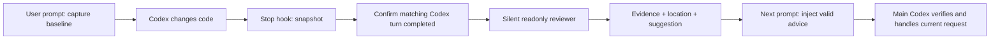

# AutoReview

**Quiet code review. Useful advice in your next Codex turn.**

[中文文档](../README.md) · [Prompt contract](prompts.md) · [Architecture](architecture.md) · [Validation](validation.md)

AutoReview uses official Codex lifecycle hooks to review changed coding turns in a fresh, read-only Codex session using your existing CLI account. It reports only substantiated bugs and concise suggestions. Every completed report joins a persistent FIFO queue. The next user prompt receives the queued reports through the official `additionalContext` hook output, so the main agent can verify and address them within the current request.

The background reviewer never edits source, applies patches, installs dependencies, executes test jobs, commits, or pushes. It stays silent until its final structured report. Chinese requests produce Chinese findings.

## Install

Requires Node.js 20.11+, Git, and an authenticated Codex CLI supporting hooks, plugins, and App Server.

```sh
npm run setup -- --project /absolute/path/to/your/project
```

No npm dependencies or JavaScript build. On macOS, the installer builds a small AppKit/WebKit floating window using the system Swift compiler at `~/Applications/AutoReview.app`. If build tools are unavailable, it opens the local web panel. Linux and Windows use the web panel.

1. Setup configures and verifies the six AutoReview hooks through the official App Server configuration API. No interactive CLI trust steps.
2. Start a new Codex conversation after installing/updating. To continue an existing task, use the panel's **Connection help → Open plugin in Codex**, then toggle AutoReview off and on once.
3. Click **Codex project toolbar → Actions → AutoReview** to connect and enable that task's project automatically. No path entry.

The macOS panel and its collapsed launcher follow Codex: switching to another app, hiding/minimizing Codex, or moving to a Space without its main window hides both. Returning restores the previous expanded/collapsed state. Viewing another project in the panel does not pause any enabled projects.

The current-project connection button lives in Codex's toolbar because the companion has no public API for querying the GUI's focused task. Its action receives the exact task working directory. For a new project without an Action yet, add the stable launcher command through Codex's Action editor or ask the current task to enable AutoReview. The plugin uses the task workspace; it does not guess from recent sessions or ask for a path.

The panel distinguishes enabled configuration from receiving actual Codex events. The installer updates a separate App Server process; its configuration reload cannot refresh sessions in an already running desktop host. The Codex plugin toggle reloads that host's configuration. Merely opening the settings page or verifying installation does not do so. Recent events are scoped to a project and may belong to another task. See [connection troubleshooting](hook-troubleshooting.md) for evidence and recovery.

The first review has an explicit waiting state. A failed latest attempt shows its cause and a history link, while earlier pending advice remains available. An empty queue never turns a failed review into a clean result.

## Behavior



A new user message never waits for an unfinished review. Completed reports, including clean summaries, are queued FIFO. Each message receives all pending reports for its project/conversation, up to **48,000 UTF-16 characters**. Whole reports beyond the cap remain queued; nothing is truncated or overwritten. Reports concerning changed source are delivered with a recheck marker. Manual reports go to the next message in that project. Delivered reports leave the queue and remain in history. Individual reports are capped at **6,000 characters**, enforced by the prompt, schema, and runtime validation.

Reports leave the queue only after the dispatcher confirms a successful complete stdout write. Lost responses, broken pipes, and missing acknowledgements retain reports for a later prompt. Lost acknowledgements or concurrent inputs can produce duplicates; the prompt tells Codex to skip already handled review IDs. This confirms transport handoff, not host parsing, model consumption, or a fixed bug. Host crashes after handoff cannot be covered by an exactly-once guarantee.

Automatic review requires a final Stop with no outstanding write tools, then confirmation that the exact Codex turn has completed its work and answer. The official App Server query reads lifecycle metadata only. Continued work cancels the candidate snapshot. Missing confirmation skips review after 120 seconds and releases the snapshot; neither tool completion nor a debounce timer can start the reviewer by itself.

Reviews read the exact file bytes frozen at the end of the reviewed turn, even if the source changes while queued or running. Every terminal outcome waits for the review process to exit, then deletes its copy and temporary Git repository. No branch, worktree registration, or Git objects are added to the source repository. Crash leftovers are collected on the next service start.

`additionalContext` supplements model context; it does not rewrite the user's message or guarantee visual message ordering. Advice is untrusted evidence to verify, not a new instruction or authorization. The current user request takes precedence.

Closing the floating window leaves background review running. Pause the project or run `node plugins/autoreview/bin/autoreview.mjs stop` to stop it. The CLI also provides `connect`, `enable`, `disable`, `status`, `review`, `cancel`, `config`, `prune`, and `doctor`.

## Data and upgrades

Private data is kept in `~/.autoreview` (`AUTOREVIEW_HOME` overrides it). The plugin does not read or copy Codex authentication files. `AUTOREVIEW_CODEX_BIN` selects the CLI executable. Known credential paths, ignored files, and dependency directories are excluded; filename filtering is not secret-content scanning. Reviews use the normal Codex account quota, with a default five-minute deadline and one worker at a time.

Finished reviews retain their report and a freshness digest, not complete source copies. Shared content is retained only while referenced by other live reviews or active main-turn baselines. Normal history is capped at 100 records and 200 inactive turns, with at most 12 recent turns per session. Unconsumed reports are exempt from pruning. At 200 pending reports plus live jobs, new review requests are refused until reports are consumed; existing reports stay intact. Legacy recovery evidence is preserved. `prune` is optional for history management; completed v0.2 snapshot cleanup is automatic, and cleanup errors are displayed and retried.

v0.1 data is backed up and migrated; projects pause on upgrade, legacy repair runs remain historical, and old file transactions are not replayed. `npm run setup -- --uninstall` removes the plugin and stops the daemon while retaining history. Remove the optional companion app in Finder if desired.

## Development

```sh
npm test
npm run check
node scripts/smoke-real.mjs     # real account usage
node scripts/probe-installed.mjs
npm run pack:release
```

See [validation](validation.md) for observed tests and platform boundaries. MIT licensed. Community software; unrelated to OpenAI's permission-escalation Auto-review feature.

## Change attribution

Automatic reviews require paired official PreToolUse/PostToolUse evidence for a recognized Codex write. Patch edits are scoped to declared files; recognizable shell writes use their execution window. Read-only calls and standalone manual edits never trigger a review. Files overwritten after the tool or with broken version continuity are skipped. Concurrent external writes during the same tool window cannot be perfectly attributed; unrecognized script writes may be skipped. This is not OS-level authorship tracing.

Setup records only this installed plugin's exact hook hashes using `hooks/list` and `config/batchWrite`, then verifies trust. It never bypasses global hook checks or trusts other plugins.

Completion checks are cancellable along with the review: pause, cancel, and shutdown terminate the metadata query process, and a connection finishing during shutdown cannot re-enable a project. Diagnostic log maintenance trims files over 1 MiB to recent approximately 512 KiB without affecting reports.

Settings and manual-review dialogs show and retain their target project when another Codex Action changes the dashboard selection. Normal multiline setup scripts support automatic action installation; conflicting or ambiguous declarations are preserved for the Codex environment editor. Local experiment artifacts under `docs/experiments/` are excluded from Git and release archives.
